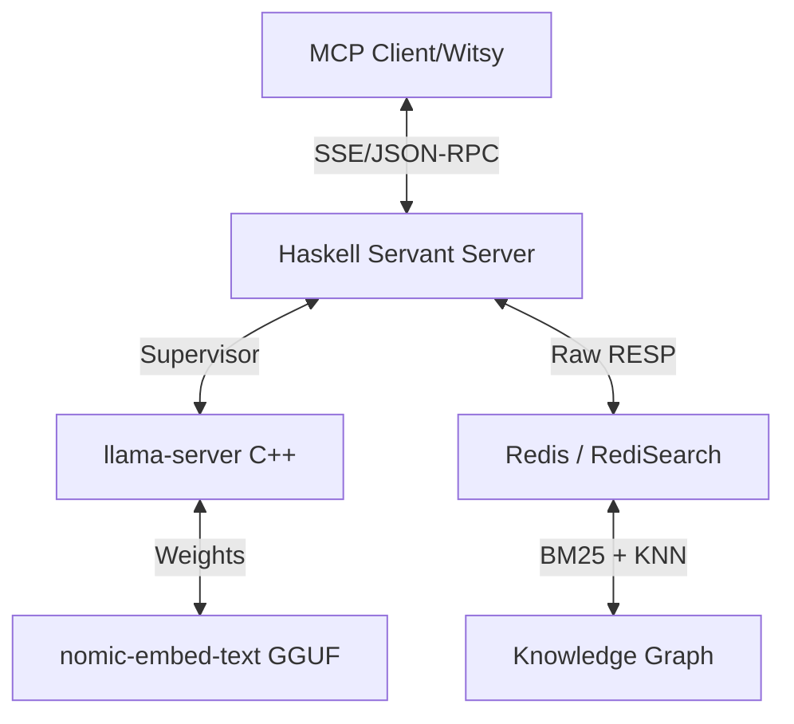

# HEngram: High-Performance Knowledge Graph MCP Server

**HEngram** is a specialized [Model Context Protocol (MCP)](https://modelcontextprotocol.io/) server that provides a high-performance, persistent knowledge graph with hybrid search capabilities. Built for maximum efficiency with a low hardware footprint, it leverages a unique dual-process architecture combining **Haskell** for protocol safety and **C++** for bare-metal embedding inference.

## 🚀 Key Features

- **Hybrid Search Engine**: Combines **BM25 text matching** and **KNN vector similarity** in a single Redis query for maximum recall and precision.
- **Server-Side Intelligence**: Built-in logic for semantic deduplication, automatic search fallback, and relationship validation.
- **Managed Llama Supervisor**: Automatically manages a local `llama-server` (C++) instance for generating high-quality embeddings via an OpenAI-compatible API.
- **Matryoshka Truncation (MRL)**: Uses the `nomic-embed-text-v1.5` model, truncated to 384 dimensions. This provides a significant speed boost and storage reduction with minimal accuracy loss.
- **Graph Relationships**: Explicit support for linking nodes with typed edges, allowing LLMs to build and navigate a structured knowledge network.
- **Pure Functional Core**: Written in Haskell for high concurrency, type-safe JSON-RPC handling, and predictable performance.

## 🧠 Server-Side Intelligence

HEngram moves critical graph logic from the LLM to the server to ensure data integrity and performance:

- **Semantic Deduplication**: When using `memorize`, HEngram checks for existing nodes with high semantic similarity within the same domain. If a duplicate is detected, it returns the existing node ID instead of creating a new one.
- **Automatic Search Fallback**: If a domain-specific `search` yields no results, HEngram automatically expands the query to a global search across all domains.
- **Ghost Edge Prevention**: The `link` tool validates that both the source and target nodes exist before creating a relationship, preventing "dangling" or "ghost" edges in the graph.

## 🏗️ Architecture



### Why Haskell + C++?
Many embedding systems rely on heavy Python stacks. HEngram uses Haskell's lightweight threads (Green Threads) to handle concurrent MCP sessions while delegating the heavy math to `llama.cpp`—the gold standard for CPU-based inference. This keeps the memory footprint low while maximizing performance across diverse environments.

## 🛠️ Tools Provided

HEngram exposes five primary tools to the LLM:

1.  **`memorize`**: Stores information into the graph with automatic deduplication.
    -   **Inputs**: `domain`, `content`, `node_type` (all required).
2.  **`search`**: Performs a hybrid search with automatic global fallback.
    -   **Inputs**: `query` (required), `domain` (optional).
3.  **`link`**: Connects two existing nodes with existence validation.
    -   **Inputs**: `source_id`, `target_id`, `rel_type` (all required).
4.  **`recall`**: Retrieves a specific node by ID, including its full content and outgoing relationships.
    -   **Inputs**: `node_id` (required).
5.  **`patch`**: Updates fields of an existing node. Only specified fields are changed.
    -   **Inputs**: `node_id` (required), `content`, `domain`, `node_type` (optional).

## 🏷️ Canonical Taxonomy

HEngram enforces a canonical taxonomy to keep the graph structured and searchable. Input values are automatically normalized to the closest match:

-   **Domains**: `personal`, `swe`, `infra`, `health`, `finance`, `recon`, `fitness`, `research`, `misc`.
-   **Node Types**: `fact`, `preference`, `project`, `person`, `decision`, `constraint`, `event`, `concept`, `procedure`, `summary`.

## ⚙️ Setup

### Prerequisites
- **GHC 9.6.6+** & **Cabal**
- **Redis** with **RediSearch** module enabled (Default port: 6379)
- **curl** & **unzip** (for automated binary setup)

### Installation
1.  Clone the repository:
    ```bash
    git clone https://github.com/di5rupt0r/HEngram.git
    cd HEngram
    ```
2.  Build the project:
    ```bash
    cabal build
    ```
3.  Run the server:
    ```bash
    cabal run hengram
    ```
    *Note: On the first run, HEngram will automatically download `llama-server` and the embedding model. The embedding server runs on port **8081** by default.*

## 📄 License
This project is licensed under the **MIT License**.
