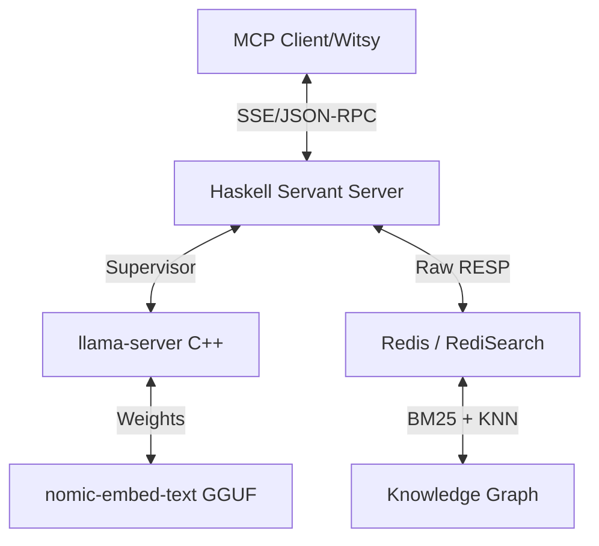

# HEngram: High-Performance Knowledge Graph MCP Server

**HEngram** is a specialized [Model Context Protocol (MCP)](https://modelcontextprotocol.io/) server that provides a high-performance, persistent knowledge graph with hybrid search capabilities. Built for efficiency on legacy hardware (e.g., Core 2 Quad systems), it leverages a unique dual-process architecture combining **Haskell** for protocol safety and **C++** for bare-metal embedding inference.

## 🚀 Key Features

- **Hybrid Search Engine**: Combines **BM25 text matching** and **KNN vector similarity** in a single Redis query for maximum recall and precision.
- **Managed Llama Supervisor**: Automatically manages a local `llama-server` (C++) instance for generating high-quality embeddings without requiring Python or heavy weight runtimes.
- **Matryoshka Truncation (MRL)**: Uses the `nomic-embed-text-v1.5` model, truncated from 768 to 384 dimensions and re-normalized. This provides a 2x speed boost and 50% storage reduction with minimal accuracy loss—perfect for memory-constrained environments.
- **Graph Relationships**: Explicit support for linking nodes with typed edges, allowing LLMs to build and navigate a structured knowledge network.
- **Pure Functional Core**: Written in Haskell for high concurrency, type-safe JSON-RPC handling, and predictable performance.

## 🏗️ Architecture

HEngram is designed around the principle that **Code = Liability** and **Performance = Efficiency**.



### Why Haskell + C++?
Many embedding systems rely on heavy Python stacks. HEngram uses Haskell's lightweight threads (Green Threads) to handle concurrent MCP sessions while delegating the heavy math to `llama.cpp`—the gold standard for CPU-based inference. This keeps the memory footprint low while maximizing CPU utilization on older architectures.

## 🛠️ Tools Provided

HEngram exposes three primary tools to the LLM:

1.  **`engram_memorize`**: Stores information into the graph.
    -   Inputs: `content`, `domain`, `node_type`.
2.  **`engram_search`**: Performs a hybrid search.
    -   Inputs: `query`, `domain` (optional).
3.  **`engram_link`**: Connects two existing nodes.
    -   Inputs: `source_id`, `target_id`, `rel_type`.

## ⚙️ Setup

### Prerequisites
- **GHC 9.6.6+** & **Cabal**
- **Redis** with **RediSearch** module enabled
- **curl** & **unzip** (for automated binary setup)

### Installation
1.  Clone the repository:
    ```bash
    git clone https://github.com/di5rupt0r/HEngram.git
    cd HEngram
    ```
2.  Build the project:
    ```bash
    cabal build
    ```
3.  Run the server:
    ```bash
    cabal run hengram
    ```
    *Note: On the first run, HEngram will automatically download and extract `llama-server` and the embedding model.*

## 📄 License
This project is licensed under the **MIT License**.
